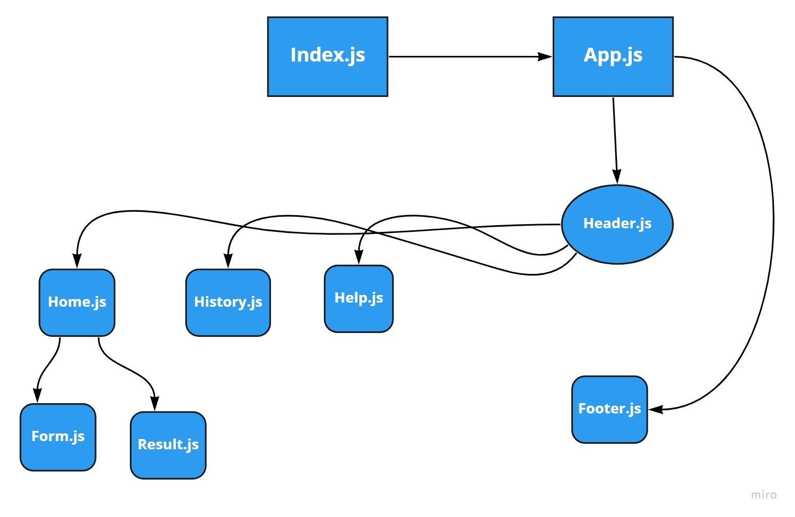

# Resty 
 build  RESTy application, using  React function components thats is do all Ristfull Api

 # Netlify
 [Link for the Netlify](https://628b45560c8e941579fda7c1--incredible-treacle-1fe45a.netlify.app/)

 # UML 

